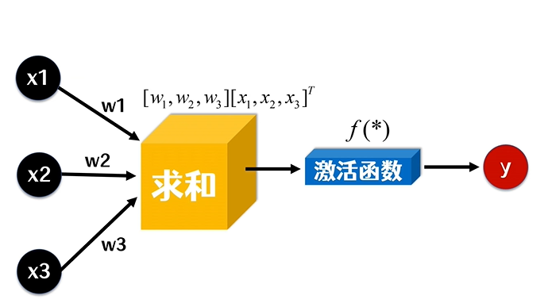

# simple-NN
一个最简单的神经网络前端实现例子

  
  

## Issues
使用的时候遇到任何问题或有好的建议，请点击进入[issue](https://github.com/lab-contrib/simple-NN/issues)，欢迎参与维护！

## 说明

我们的问题是四个人，甲、乙、丙、丁，下面是他们之前去不去看电影的数据：

|甲|乙|丙|丁|
|---|---|---|---|
|不去|不去|去|不去|
|去|去|去|去|
|去|不去|去|去|
|不去|去|去|不去|

现在的问题是，如果下次可以确定：甲去、乙去、丙不去，那么丁去的概率是多少？

我们的模型如下：

x1、x2、x3分别表示甲、乙、丙去不去的值，去就是1，不去是0。输出y表示丁去不去的值。

其中w1、w2、w3分别表示甲、乙、丙的权重，激活函数使用的是sigmoid，也就是：

权重进行随机，然后利用已知是值进行训练，不停调整权重，最终，把需要求解的数据输入获取结果即可。

具体的代码你可以查看：

- JavaScript版本：[index.js](./index.js)
- Python3版本：[index.py](./index.py)

开源协议
---------------------------------------
[MIT](https://github.com/lab-contrib/simple-NN/blob/master/LICENSE)

Copyright (c) 2022 [hai2007](https://hai2007.github.io/SweetHome/) 走一步，再走一步。
